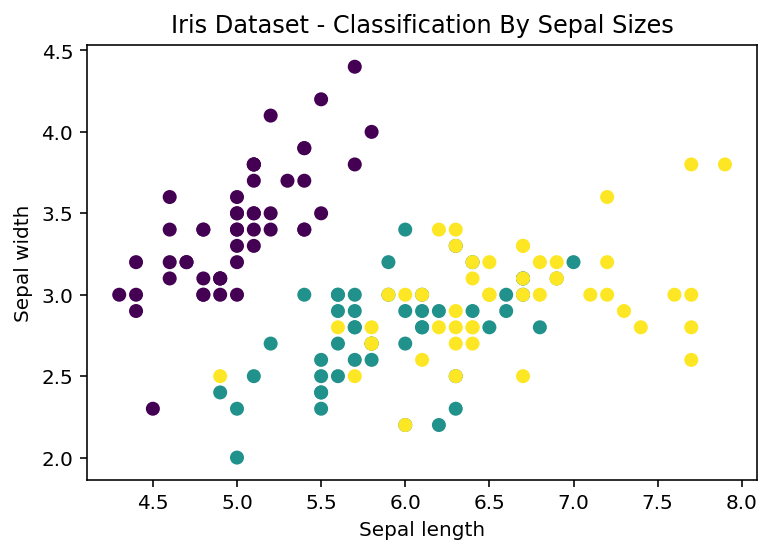
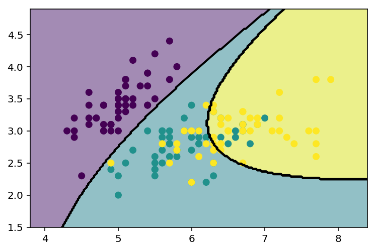

# 8. scikit-learn & MachineLearning

## 8.1 scikit-learn 库

## 8.2 MachineLearning


* 在学习阶段，遵从某种模式的数据可以是数组形式，其中每个元素只包含单个/多个值，即* 特征 (feature) / 属性 (attribute)* 。


### 8.2.1 Supervised Learning & Unsupervised Learning


* **Supervised Learning**   
  训练集包含作为预测结果（目标值）的额外的属性信息；可以指导模型对新数据（测试集）作出跟已有数据类似的预测结果。    
 > * **Classification** : 训练数据集属于两种/以上类别；已标注的数据可指导系统学习能够识别每个类别的特征。预测系统未见过的新数据时，系统将根据新数据的特征，评估其类别。     
 > * **Regression** : 被预测结果为连续型变量。     

* **Unsupervised Learning**    
  训练集数据由一系列输入值 x 组成，其目标值未知。    
  > * **Cluster** : 发现数据集中由相似的个体组成的群组。    
  > * **Dimensionality Reduction** : 将高维数据集的维度减少到两维/三维，不仅可以便于数据可视化；而且降低唯独后，每一维传递的信息更多。     
  

### 8.2.2 训练集和测试集


 通过 ML 用数据集创建模型，识别模型的特性  之后，再用来处理新数据。评估算法用来评估算法的好坏，需要把算法分为 **训练集** 和 **测试集** 两部分，从前者学习数据特性，用后者测试得到的特性。

## 8.3 用 scikit-learn 实现Supervised Learning


etc: 
 * *Iris Dataset*    
  > * **k-Nearest Neighbor** ；即 **KNN** .    
  > * **Supporting Vector Classification** ；即 **SVC** .   
 
 * *Diabets Dataset*     
  > * **Linear Regression** .   
  > * **Supporting Vector Regression** .
  
  
* **scikit-learn** 的所有模型都是 **Supervised Learning**，训练估计器要用到 $fit(x,y)$ 函数：     
 其中 $x$ 为特征，$y$ 为目标。     
  估计器经过训练后，就能预测任何标签未知的新数据 $x$ 的 $y$值 ：预测由 $predict(x)$ 完成的。

## 8.4 Iris Dataset


* **Iris Dataset**是由1936年，Sir Ronald Fister 第一次用于数据挖掘实验；又称安德森鸢尾花卉数据集。     
 该数据集的数据采自三种不同鸢尾花卉（山鸢尾、变色鸢尾、弗吉尼亚鸢尾），萼片和花瓣的长宽。


```python
import numpy as np
import matplotlib.pyplot as plt
import pandas as pd
% matplotlib inline
% config InlineBackend.figure_format='retina'

from sklearn import datasets
```


```python
iris = datasets.load_iris()
```

* **iris** 输出结果为一个包含150个元素的数组，每个元素包含四个数值，分别为萼片和花瓣的数据。      
* 要知道每种花卉的种类，访问 **iris** 的 **target** 属性即可。


```python
iris.target
```


    array([0, 0, 0, 0, 0, 0, 0, 0, 0, 0, 0, 0, 0, 0, 0, 0, 0, 0, 0, 0, 0, 0, 0,
           0, 0, 0, 0, 0, 0, 0, 0, 0, 0, 0, 0, 0, 0, 0, 0, 0, 0, 0, 0, 0, 0, 0,
           0, 0, 0, 0, 1, 1, 1, 1, 1, 1, 1, 1, 1, 1, 1, 1, 1, 1, 1, 1, 1, 1, 1,
           1, 1, 1, 1, 1, 1, 1, 1, 1, 1, 1, 1, 1, 1, 1, 1, 1, 1, 1, 1, 1, 1, 1,
           1, 1, 1, 1, 1, 1, 1, 1, 2, 2, 2, 2, 2, 2, 2, 2, 2, 2, 2, 2, 2, 2, 2,
           2, 2, 2, 2, 2, 2, 2, 2, 2, 2, 2, 2, 2, 2, 2, 2, 2, 2, 2, 2, 2, 2, 2,
           2, 2, 2, 2, 2, 2, 2, 2, 2, 2, 2, 2])


```python
iris.target_names
```


    array(['setosa', 'versicolor', 'virginica'],
          dtype='<U10')


* 用三种颜色表示三种花卉种类，绘制一幅散点图，$x轴$ 表示萼片长度，$y轴$ 表示萼片宽度。


```python
import matplotlib.patches as mpatches

iris = datasets.load_iris()
x = iris.data[:,0]    # X-Axis - sepal length
y = iris.data[:,1]    # Y-Axis - sepal length
species = iris.target # Species

### SCATTERPLOT ###
plt.figure()
plt.title('Iris Dataset - Classification By Sepal Sizes')
plt.scatter(x,y,c=species)
plt.xlabel('Sepal length')
plt.ylabel('Sepal width')

#plt.xticks(())
#plt.yticks(())
```


    Text(0,0.5,'Sepal width')





山鸢尾为最深的一簇，与其他点分开来。    

* 改用花瓣的长和宽两个变量绘制图表


```python
iris = datasets.load_iris()
x = iris.data[:,2]
y = iris.data[:,3]
species = iris.target

plt.figure()
plt.title('Iris Dataset - Classification By Petal Sizes',size=14)
plt.scatter(x,y,c=species)
plt.xlabel('Petal length')
plt.ylabel('Petal width')
```


    Text(0,0.5,'Petal width')


### 主成分分解

        上一个例子尝试用花瓣花萼的四个数据描述三种花卉的特点，但是即使用 3D散点图也无法整合四个维度。

* 主成分分析法 **( Principal Component Analysis , PCA )**     
 该方法可以减少系统维数，保留足以描述各数据点特征的信息，其中新生成的各维叫 *主成分* 。对于上述例子，把四维减少到三维后，就能把结果转换为 3D散点图。
 
* **scikit-learn库** 的 **fit_transform( )** 就是用来降维的，属于 **PCA** 对象。   
 1. 使用前，需要先导入 **PCA** 模块 **sklearn.decomposition**，   
 2. 然后使用 **PCA( )** 构造函数，用 **n_components** 选项指定要降到几维（主成分）。   
 3. 最后调用 **fit_transform( )** 函数，传入四维的 **Iris Dataset** 作为参数。


```python
import matplotlib.pyplot as plt
from mpl_toolkits.mplot3d import Axes3D
from sklearn import datasets
from sklearn.decomposition import PCA

iris = datasets.load_iris()
x = iris.data[:,1]
y = iris.data[:,2]
species = iris.target
x_reduced = PCA(n_components=3).fit_transform(iris.data)

fig = plt.figure()
ax = Axes3D(fig)
ax.set_title('Iris Dataset by PCA',size=14)
ax.scatter(x_reduced[:,0],x_reduced[:,1],x_reduced[:,2],c=species)

ax.set_xlabel('First eigenvector')
ax.set_ylabel('Second eigenvector')
ax.set_zlabel('Third eigenvector')

#ax.w_xaxis.set_ticklabels(())
#ax.w_yaxis.set_ticklabels(())
#ax.w_zaxis.set_ticklabels(())
```


    Text(0.5,0,'Third eigenvector')


## 8.5 K - 邻近分类器

   需要一个分类器完成以下任务：给定一种鸢尾花卉的测量数据，为这种花卉分类。最简单的分类器是 **邻近分类器** 。邻近算法搜索训练集，寻找与用作测试的新个体最相似的观测记录。
    
* 如果只有一个数据集，需要分成两份：一份用于训练算法，另一份用于验证算法。    

* 在此用 **Numpy** 的 **random.permutation( )** 打乱数据集所有元素，打乱后的数据集依旧包含150条不同数据，前140条用作训练集，剩余10条作测试集。


```python
np.random.seed(0)
iris = datasets.load_iris()
x = iris.data
y = iris.target
i = np.random.permutation(len(iris.data))
x_train = x[i[:-10]]
y_train = y[i[:-10]]
x_test = x[i[-10:]]
y_test = y[i[-10:]]
```

* 用 **KNN**，导入 **KNeighborsClassifier**， 调用分类器的构造函数，再用 **fit( )** 函数对其进行训练。


* **KNeighborsClassifier** 使用分三步：    
  1. 创建** KNeighborsClassifier** 对象    
  2. 调用 **fit** 函数     
  3. 调用 **predict** 函数进行预测。


```python
from sklearn.neighbors import KNeighborsClassifier
knn = KNeighborsClassifier()
knn.fit(x_train,y_train)
```


    KNeighborsClassifier(algorithm='auto', leaf_size=30, metric='minkowski',
               metric_params=None, n_jobs=1, n_neighbors=5, p=2,
               weights='uniform')


* 用140条观测数据训练 *knn* 分类器，得到预测模型。然后将验证其效果。分类器应该能够正确预测测试集中10条观测数据对应的类别。要获取预测结果，可以直接在预测模型 *knn* 上调用 **predict** 函数。最后将预测结果和 **y_test** 中的实际值比较。


```python
knn.predict(x_test)
```


    array([1, 2, 1, 0, 0, 0, 2, 1, 2, 0])


```python
y_test
```


    array([1, 1, 1, 0, 0, 0, 2, 1, 2, 0])


* 错误率为 $10\%$。可以在用萼片数据绘制的 2D散点图中，画出 *决策边界( **decicion boundary** )*。


```python
from matplotlib.colors import ListedColormap

iris = datasets.load_iris()
x = iris.data[:,:2]
y = iris.target
x_min,x_max = x[:,0].min()-0.5, x[:,0].max()+0.5
y_min,y_max = x[:,1].min()-0.5, x[:,1].max()+0.5

cmap_light = ListedColormap(['#66ccff','#aaffaa','#ffaaaa'])
h = 0.02
xx,yy = np.meshgrid(np.arange(x_min,x_max,h),
                    np.arange(y_min,y_max,h))
knn = KNeighborsClassifier()
knn.fit(x,y)
Z = knn.predict(np.c_[xx.ravel(),yy.ravel()])
Z = Z.reshape(xx.shape)
plt.figure()
plt.pcolormesh(xx,yy,Z,cmap=cmap_light)

### Plot the training pointss ###
plt.scatter(x[:,0],x[:,1],c=y)
plt.xlim(xx.min(),xx.max())
plt.ylim(yy.min(),yy.max())
```


    (1.5, 4.900000000000003)


* 在用花瓣数据绘制的散点图中，也可以画出 *决策边界*。


```python
iris = datasets.load_iris()
x = iris.data[:,2:4]
y = iris.target
x_min,x_max = x[:,0].min()-0.5, x[:,0].max()+0.5
y_min,y_max = x[:,1].min()-0.5, x[:,1].max()+0.5

cmap_light = ListedColormap(['#66ccff','#aaffaa','#ffaaaa'])
h = 0.02
xx,yy = np.meshgrid(np.arange(x_min,x_max,h),
                    np.arange(y_min,y_max,h))
knn = KNeighborsClassifier()
knn.fit(x,y)
Z = knn.predict(np.c_[xx.ravel(),yy.ravel()])
Z = Z.reshape(xx.shape)
plt.figure()
plt.pcolormesh(xx,yy,Z,cmap=cmap_light)

### Plot the training pointss ###
plt.scatter(x[:,0],x[:,1],c=y)
plt.xlim(xx.min(),xx.max())
plt.ylim(yy.min(),yy.max())
```


    (-0.40000000000000002, 2.9800000000000031)


## 8.6 Diabetes Dataset

** Diabetes Dataset**，即糖尿病数据集，最早于2004年中用到。    
首先调用 **load_diabetes( )** 加载数据集，并保存在 **diabetes** 变量中。    


```python
from sklearn import datasets
diabetes = datasets.load_diabetes()
```

* 该数据集包含442位病人的生理数据以及一年后的病情发展情况，后者即为目标值。前十列数值为生理数据，分别表示以下特征：   
 > * 年龄    
 > * 性别    
 > * 体质指数    
 > * 血压    
 > * S1, S2, S3, S4, S5, S6（六种血清的化验结果）   
 
* 调用 **data** 属性，可以获取到测量数据。


```python
diabetes.data[0]
```


    array([ 0.03807591,  0.05068012,  0.06169621,  0.02187235, -0.0442235 ,
           -0.03482076, -0.04340085, -0.00259226,  0.01990842, -0.01764613])


* 这十个数据都做了均值中心化处理，然后用标准差乘以个体数量调整数值范围。验证后发现任何一列的所有值和为1.


```python
np.sum(diabetes.data[:,0]**2)
```


    1.0000000000000746


* 表示疾病进展的数据，用 **target** 属性读取。   
 > diabetes.target

## 8.7 线性回归：最小平方回归

* Linear Regression是指用训练集数据创建线性模型的过程。最简单的形式是基于以下参数 $a$, $c$。     
 在计算参数时，以**最小化差残平方和**为前提。    
$$y=a*x+c$$
* $x$ 为训练集，$y$ 为目标值，$a$ 为斜率，$c$ 为模型所对应的直线的斜率。如果要用 **scikit-learn库** 的 **LinearRegression** 预测模型，必须导入 **linear_model** 模块，然后用 **LinearRegression( )** 构造函数创建预测模型，命名为 **linreg**。


```python
from sklearn import linear_model
linreg = linear_model.LinearRegression()
```

* 先把包含442位病人的病情数据分为训练集（前422位病人的数据），测试集（后20位病人的数据）。


```python
from sklearn import datasets
diabetes = datasets.load_diabetes()
x_train = diabetes.data[:-20]
y_train = diabetes.target[:-20]
x_test = diabetes.data[-20:]
y_test = diabetes.target[-20:]
```

* 在预测模型上调用 **fit( )**，使用训练集做训练。


```python
linreg.fit(x_train,y_train)
```


    LinearRegression(copy_X=True, fit_intercept=True, n_jobs=1, normalize=False)


* 训练完模型后，调用预测模型的 **coef\_** 属性，就可以得到每种（共10种）生理数据的回归系数 $b$。


```python
linreg.coef_
```


    array([  3.03499549e-01,  -2.37639315e+02,   5.10530605e+02,
             3.27736980e+02,  -8.14131709e+02,   4.92814588e+02,
             1.02848452e+02,   1.84606489e+02,   7.43519617e+02,
             7.60951722e+01])


* 在预测模型 **linreg** 上调用 **predict( )**，传入测试集作为参数，将得到一列可以拿来与实际目标值相比较的预测目标值。


```python
linreg.predict(x_test)
```


    array([ 197.61846908,  155.43979328,  172.88665147,  111.53537279,
            164.80054784,  131.06954875,  259.12237761,  100.47935157,
            117.0601052 ,  124.30503555,  218.36632793,   61.19831284,
            132.25046751,  120.3332925 ,   52.54458691,  194.03798088,
            102.57139702,  123.56604987,  211.0346317 ,   52.60335674])


```python
y_test
```


    array([ 233.,   91.,  111.,  152.,  120.,   67.,  310.,   94.,  183.,
             66.,  173.,   72.,   49.,   64.,   48.,  178.,  104.,  132.,
            220.,   57.])


* **方差** ：用来评价预测结果好坏的指标。方差越接近1，预测结果越准确。


```python
linreg.score(x_test,y_test)
```


    0.58507530226905713


* 现在就可以用LinearRegression分析单个生理因素与目标值之间的关系，比如：年龄


```python
from sklearn import linear_model
from sklearn import datasets
diabetes = datasets.load_diabetes()
x_train = diabetes.data[:-20]
y_train = diabetes.target[:-20]
x_test = diabetes.data[-20:]
y_test = diabetes.target[-20:]

x0_test = x_test[:,0]
x0_train = x_train[:,0]
x0_test = x0_test[:,np.newaxis]
x0_train = x0_train[:,np.newaxis]
linreg = linear_model.LinearRegression()
linreg.fit(x0_train,y_train)
y = linreg.predict(x0_test)
plt.scatter(x0_test,y_test)
plt.plot(x0_test,y,color='#ee0000',linewidth=2)
```


    [<matplotlib.lines.Line2D at 0x11085b898>]


* **Diabetes** 数据集实际上有10个生理因素。对每个生理特征进行回归分析，创建10个模型，将其结果作出10幅图表。


```python
x_train = diabetes.data[:-20]
y_train = diabetes.target[:-20]
x_test = diabetes.data[-20:]
y_test = diabetes.target[-20:]

plt.figure(figsize=(8,12))
for f in range(10):
    xi_test = x_test[:,f]
    xi_train = x_train[:,f]
    xi_test = xi_test[:,np.newaxis]
    xi_train = xi_train[:,np.newaxis]
    linreg.fit(xi_train,y_train)
    y = linreg.predict(xi_test)
    plt.subplot(5,2,f+1)
    plt.scatter(xi_test,y_test,color='c')
    plt.plot(xi_test,y,color='r',linewidth=2)
```


## 8.8 Support Vector Machine

* **Support Vector Machine** 即 **SVM**，指的是一系列 ML 方法。最初在20世纪90年代初由 AT&T 的 Vapnik 和同事一起开发的。其基础是 *支持向量算法*，该算法是对 *广义肖像算法 (Generalized Portait)* 的拓展，后者是63年 Vapnik 在苏联开发的 //滑稽.jpg。    


* **SVM** 分类器是二元或判别模型，对两类数据进行区分。最基础的任务是判断新观测数据属于两个类别中的哪一个。在学习阶段，这类分类器把训练数据映射到 **决策空间(decidion space)**（多维空间），创建 **决策边界**（分离面），把决策空间分为两个区域。      


* 在最简单的线性可分的情况下，决策边界可以用平面（3D）/直线（2D）表示。在更复杂的情况中，分离面为曲面，情况更复杂。    


* **SVM** 既可用于回归问题：**SVR (Support Vector Regression)**；   
   也可用于分类问题：**SVC (Support Vector Classification)**。

### 8.8.1 SVC

* 先来研究二维空间线性分类问题，其决策边界为一条直线，把决策区域一分为二。    
* etc：
  训练集包含11个点，有取值范围均为0～4的两个不同属性，这些数据点属性存放在 x数组中。数据点所属类别用0/1表示，类别信息存储在 y数组中。      
  把这些数据点绘制成散点图，观察它们在空间上的分布情况，该空间可以被称为决策空间。


```python
import numpy as np
import matplotlib.pyplot as plt
from sklearn import svm

x = np.array([[1,3],[1,2],[1,1.5],[1.5,2],[2,3],[2.5,1.5],
              [2,1],[3,1],[3,2],[3.5,1],[3.5,3]])
y = [0]*6 + [1]*5
plt.scatter(x[:,0],x[:,1],c=y,s=50,alpha=0.9)
```


    <matplotlib.collections.PathCollection at 0x10e7d7860>


* 在定义好训练集后，用 **SVC** 进行训练。该算法会创建一条直线（决策边界），把决策区域分为两部分，直线所处区域应该使得训练集中距离直线最近的几个数据点到直线距离最大化。   


* 用训练集训练 **SVC** 算法之前，先用 **SVC( )** 构造函数定义模型，使用线性内核。然后调用 **fit( )** 函数，传入训练集作为参数。模型训练完成后，用 **decision_function( )** 函数绘制决策边界。    
* 绘制散点图时，注意决策空间的两部分使用不同颜色。


```python
x = np.array([[1,3],[1,2],[1,1.5],[1.5,2],[2,3],[2.5,1.5],
              [2,1],[3,1],[3,2],[3.5,1],[3.5,3]])
y = [0]*6 + [1]*5
svc = svm.SVC(kernel='linear').fit(x,y)
X,Y = np.mgrid[0:4:200j,0:4:200j]
Z = svc.decision_function(np.c_[X.ravel(),Y.ravel()])
Z = Z.reshape(X.shape)
plt.contourf(X,Y,Z>0,alpha=0.4)
plt.contour(X,Y,Z,colors=['k'],levels=[0])
plt.scatter(x[:,0],x[:,1],s=50,alpha=0.9,c=y)
```


    <matplotlib.collections.PathCollection at 0x1108167f0>


* 训练模型完成后，就可以进行预测。新观察到的数据分类取决于数据点在图中的位置。


* **predict( )** 函数会以数值形式返回数据点所属的类别（0为蓝色，1为黄色）。


```python
svc.predict(np.array([1.5,2.5]).reshape(1, -1))
```


    array([0])


```python
svc.predict(np.array([2.5,1]).reshape(1, -1) )
```


    array([1])


* *正则化* 是一个与 **SVC** 算法相关的概念，用参数 $C$ 来设置：   
  $C$值较小，表示计算间隔时，将分界线两侧的大量甚至全部数据点都考虑在内（泛化能力强）；   
  $C$值较大，表示只考虑分界线附近的数据点（泛化能力弱）。    
  若不指定$C$值，默认=1。    
  可以通过 **support_vectors** 数组获取到参与计算间隔的数据点，为其添加高亮效果。


```python
x = np.array([[1,3],[1,2],[1,1.5],[1.5,2],[2,3],[2.5,1.5],
              [2,1],[3,1],[3,2],[3.5,1],[3.5,3]])
y = [0]*6 + [1]*5
svc = svm.SVC(kernel='linear').fit(x,y)
X,Y = np.mgrid[0:4:200j,0:4:200j]
Z = svc.decision_function(np.c_[X.ravel(),Y.ravel()])
Z = Z.reshape(X.shape)
plt.contourf(X,Y,Z>0,alpha=0.4)
plt.contour(X,Y,Z,colors=['k','k','k'],linestyles=['--','-','--'],levels=[-1,0,1])
plt.scatter(svc.support_vectors_[:,0],svc.support_vectors_[:,1],s=120,facecolors='r')
plt.scatter(x[:,0],x[:,1],c=y,s=50,alpha=0.9)
```


    <matplotlib.collections.PathCollection at 0x1a15dea2b0>


* 上图中高亮的点位于分界线附近的评价区域之内。


* 为了理解参数$C$对决策边界的影响，可以给$C$赋一个很小的值，比如0.1，来计算下间隔用到了多少数据点。


```python
x = np.array([[1,3],[1,2],[1,1.5],[1.5,2],[2,3],[2.5,1.5],
              [2,1],[3,1],[3,2],[3.5,1],[3.5,3]])
y = [0]*6 + [1]*5
svc = svm.SVC(kernel='linear',C=0.1).fit(x,y)
X,Y = np.mgrid[0:4:200j,0:4:200j]
Z = svc.decision_function(np.c_[X.ravel(),Y.ravel()])
Z = Z.reshape(X.shape)
plt.contourf(X,Y,Z>0,alpha=0.4)
plt.contour(X,Y,Z,colors=['k','k','k'],linestyles=['--','-','--'],levels=[-1,0,1])
plt.scatter(svc.support_vectors_[:,0],svc.support_vectors_[:,1],s=120,facecolors='r')
plt.scatter(x[:,0],x[:,1],c=y,s=50,alpha=0.9)
```


    <matplotlib.collections.PathCollection at 0x1a16074f60>


### 8.8.2 非线性 SVC

* **SVC** 线性算法，旨在定义一条把数据分为两类的分界线。一些更复杂的 **SVC**算法，能够建立曲线或者曲面，所依据的原则依旧是最大化离表面最近的数据点之间的距离。


* 可以定义一条多项式曲线把决策空间分为两块。多项式的次数可用 **degree** 选项指定，即使是非线性 **SVC**，$C$依旧是正则化回归系数。尝试使用内核为三次多项式，$C=1$的 **SVC**算法。


```python
x = np.array([[1,3],[1,2],[1,1.5],[1.5,2],[2,3],[2.5,1.5],
              [2,1],[3,1],[3,2],[3.5,1],[3.5,3]])
y = [0]*6 + [1]*5
svc = svm.SVC(kernel='poly',C=1).fit(x,y)
X,Y = np.mgrid[0:4:200j,0:4:200j]
Z = svc.decision_function(np.c_[X.ravel(),Y.ravel()])
Z = Z.reshape(X.shape)
plt.contourf(X,Y,Z>0,alpha=0.4)
plt.contour(X,Y,Z,colors=['k','k','k'],linestyles=['--','-','--'],levels=[-1,0,1])
plt.scatter(svc.support_vectors_[:,0],svc.support_vectors_[:,1],s=120,facecolors='r')
plt.scatter(x[:,0],x[:,1],c=y,s=50,alpha=0.9)
```


    <matplotlib.collections.PathCollection at 0x1a1626ba90>


* 另一种非线性内核为 *径向基函数 **(Radial Function, RBF)** *。    
 这种内核生成的分隔面尝试把数据集的各个数据点分到沿径向分布的不同区域。


```python
x = np.array([[1,3],[1,2],[1,1.5],[1.5,2],[2,3],[2.5,1.5],
              [2,1],[3,1],[3,2],[3.5,1],[3.5,3]])
y = [0]*6 + [1]*5
svc = svm.SVC(kernel='rbf',C=1,gamma=3).fit(x,y)
X,Y = np.mgrid[0:4:200j,0:4:200j]
Z = svc.decision_function(np.c_[X.ravel(),Y.ravel()])
Z = Z.reshape(X.shape)
plt.contourf(X,Y,Z>0,alpha=0.4)
plt.contour(X,Y,Z,colors=['k','k','k'],linestyles=['--','-','--'],levels=[-1,0,1])
plt.scatter(svc.support_vectors_[:,0],svc.support_vectors_[:,1],s=120,facecolors='r')
plt.scatter(x[:,0],x[:,1],c=y,s=20,alpha=0.9)
```


    <matplotlib.collections.PathCollection at 0x1a14d58c88>


### 8.8.3 绘制 SVC 分类器对 Iris数据集的分类效果图

* 之前用SVC算法仅从包含两个类别的训练集中学习。在 Iris数据集中有三个类别对应三种花卉。     


* 对于这个数据集，决策边界相互交叉，把决策空间或决策体分成多个部分。    
* 两个线性模型均有线性决策边界（相交的超平面），而使用非线性内核的模型（多项式/高斯RBF）有非线性决策边界，后者在处理依赖于内核和参数的数据时更为灵活。


* **用线性内核得到的决策边界划分的决策区域。**


```python
import numpy as np
import matplotlib.pyplot as plt
from sklearn import svm,datasets

iris = datasets.load_iris()
x = iris.data[:,:2]
y = iris.target
h = 0.05
svc = svm.SVC(kernel='linear',C=1.0).fit(x,y)
x_min,x_max = x[:,0].min()-0.5, x[:,0].max()+0.5
y_min,y_max = x[:,1].min()-0.5, x[:,1].max()+0.5
h = 0.02
X,Y = np.meshgrid(np.arange(x_min,x_max,h),np.arange(y_min,y_max,h))
Z = svc.predict(np.c_[X.ravel(),Y.ravel()])
Z = Z.reshape(X.shape)
plt.contourf(X,Y,Z,alpha=0.5)
plt.contour(X,Y,Z,colors='k')
plt.scatter(x[:,0],x[:,1],c=y)
```


    <matplotlib.collections.PathCollection at 0x1102665f8>


* **用多项式内核得到的决策边界划分差别比较大。**


```python
x = iris.data[:,:2]
y = iris.target
h = 0.05
svc = svm.SVC(kernel='poly',C=1.0,degree=3).fit(x,y)
x_min,x_max = x[:,0].min()-0.5, x[:,0].max()+0.5
y_min,y_max = x[:,1].min()-0.5, x[:,1].max()+0.5
h = 0.02
X,Y = np.meshgrid(np.arange(x_min,x_max,h),np.arange(y_min,y_max,h))
Z = svc.predict(np.c_[X.ravel(),Y.ravel()])
Z = Z.reshape(X.shape)
plt.contourf(X,Y,Z,alpha=0.5)
plt.contour(X,Y,Z,colors='k')
plt.scatter(x[:,0],x[:,1],c=y)
```


    <matplotlib.collections.PathCollection at 0x10fcb65f8>





* **用RBF内核得到决策边界和决策区域。**


```python
x = iris.data[:,:2]
y = iris.target
h = 0.05
svc = svm.SVC(kernel='rbf',C=1.0,gamma=3).fit(x,y)
x_min,x_max = x[:,0].min()-0.5, x[:,0].max()+0.5
y_min,y_max = x[:,1].min()-0.5, x[:,1].max()+0.5
h = 0.02
X,Y = np.meshgrid(np.arange(x_min,x_max,h),np.arange(y_min,y_max,h))
Z = svc.predict(np.c_[X.ravel(),Y.ravel()])
Z = Z.reshape(X.shape)
plt.contourf(X,Y,Z,alpha=0.5)
plt.contour(X,Y,Z,colors='k')
plt.scatter(x[:,0],x[:,1],c=y)
```


    <matplotlib.collections.PathCollection at 0x11091fe80>


### 8.8.4 Support Vector Regression

* **SVC** 方法拓展后可以用来解决回归问题，即 ***支持向量回归 (Support Vector Regression)***。    


* **SVC**生成的模型实际上没有使用全部训练数据，而是只使用离决策边界最接近的数据点。类似的**SVR** 生成的模型也只依赖于部分训练数据。   


* 在Diabetes数据集中选取第三个生理数据，用三种不同的回归算法：线性、和两个多项式（二次和三次曲线）。    
***测试集数据必须按升序形式排列***


```python
diabetes = datasets.load_diabetes()
x_train = diabetes.data[:-20]
y_train = diabetes.target[:-20]
x_test = diabetes.data[-20:]
y_test = diabetes.target[-20:]

x0_test = x_test[:,2]
x0_train= x_train[:,2]
x0_test = x0_test[:,np.newaxis]
x0_train= x0_train[:,np.newaxis]

x0_test.sort(axis=0)
x0_test = x0_test*100
x0_train= x0_train*100
```


```python
svr1 = svm.SVR(kernel='linear',C=1000).fit(x0_train,y_train)
y1 = svr1.predict(x0_test)
plt.scatter(x0_test,y_test,color='k')
plt.plot(x0_test,y1,color='c')
```


    [<matplotlib.lines.Line2D at 0x10e827978>]


```python
svr2 = svm.SVR(kernel='poly'  ,C=1000,degree=2).fit(x0_train,y_train)
y2 = svr2.predict(x0_test)
plt.scatter(x0_test,y_test,color='k')
plt.plot(x0_test,y2,color='r')
```


    [<matplotlib.lines.Line2D at 0x10e676da0>]


```python
svr3 = svm.SVR(kernel='poly'  ,C=1000,degree=3).fit(x0_train,y_train)
y3 = svr3.predict(x0_test)
plt.scatter(x0_test,y_test,color='k')
plt.plot(x0_test,y3,color='g')
```


    [<matplotlib.lines.Line2D at 0x110178550>]


```python
plt.scatter(x0_test,y_test,color='k')
plt.plot(x0_test,y1,color='c')
plt.plot(x0_test,y2,color='r')
plt.plot(x0_test,y3,color='g')
```


    [<matplotlib.lines.Line2D at 0x1108bff60>]


